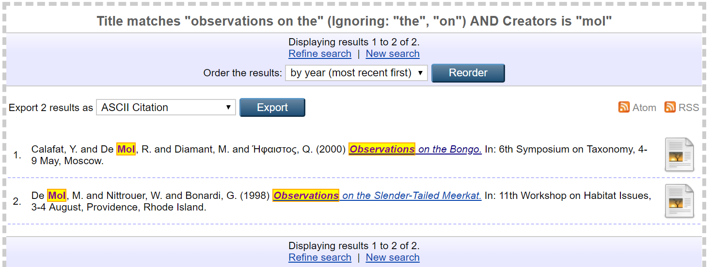

# Eprints Search Results Highlighter #
by Michele Morelli (2019)


.  
├── lib  
│   └── static  
│       ├── javascript  
│       │   ├── auto  
│       │   │   └── 90_highlighter.js  
│       │   ├── package.json  
│       │   └── test  
│       │       └── 90_highlighter.js  
│       └── style  
│           └── auto  
│               └── highlighter.css  
├── README.md  
└── search_results_highlighter.epmi 


This simple plugin highlights the search paramaters in Eprints' search results page.

It requires jQuery to run properly, so if jQuery is not already in use in 
your repository, you will need to add it to your repository somehow. 
For example, you could add the following element to the head of your 
template (default.xml):

```xml
<script src="https://ajax.googleapis.com/ajax/libs/jquery/3.3.1/jquery.min.js"></script>
```
IE is not currently supported.


Enjoy!
